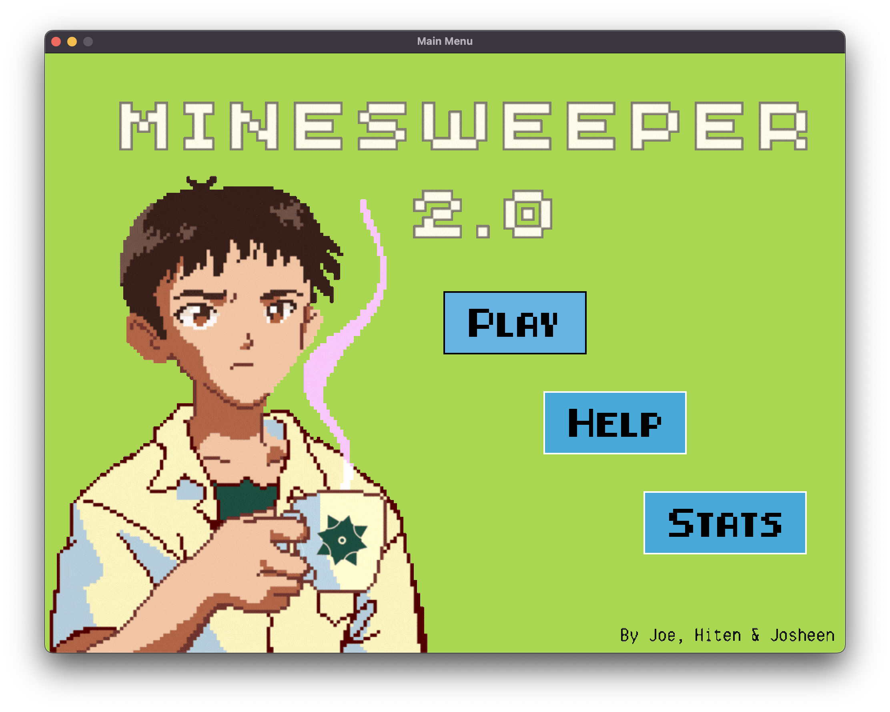
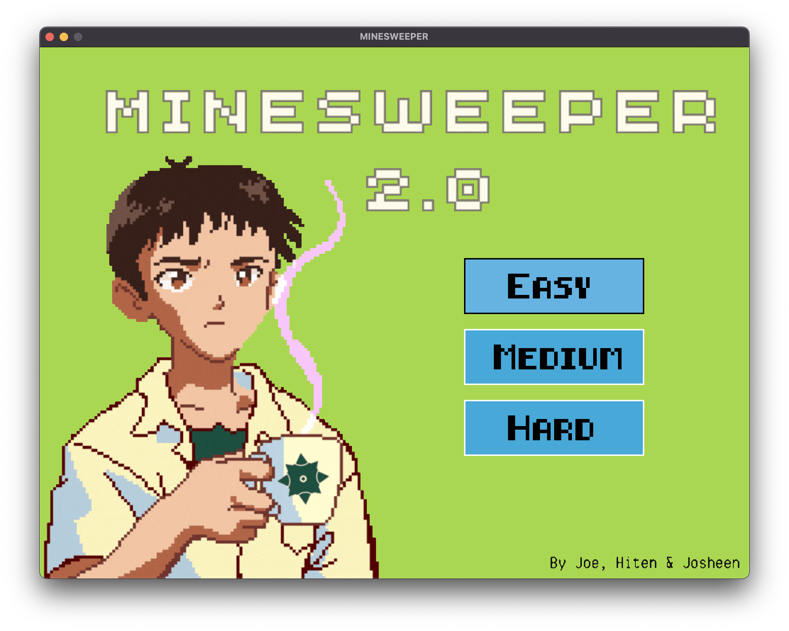
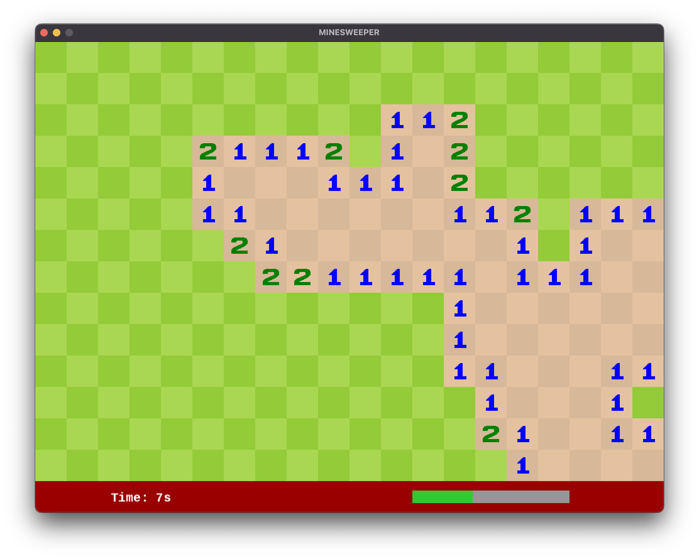
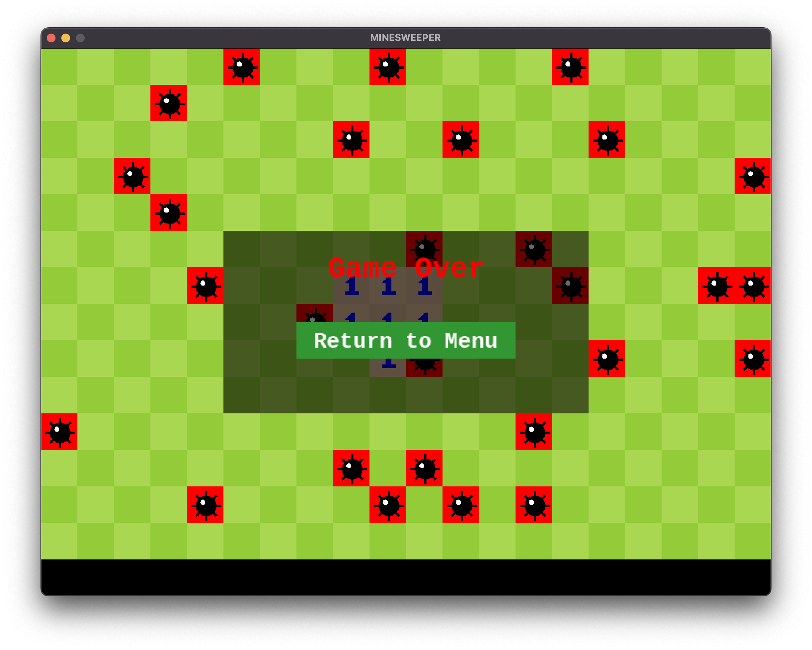

# Minesweeper 2.0
   

Minesweeper is a puzzle game where players clear a grid of hidden squares without triggering hidden mines. Numbers on revealed squares indicate how many mines are adjacent, helping players deduce the location of mines. Use flags to mark suspected mines and powerups to gain an advantage. The goal is to reveal all non-mined squares.

---

## Installation instructions
1. Install [SFML](https://www.sfml-dev.org/index.php).
2. Run `make` to compile and run the program.
3. Afterwards, run minesweeper.out to play.

---

## How to play

1. **Reveal Tiles**:
   - Left-click on a tile to reveal it.  
   - If the tile contains a number, it indicates how many mines are adjacent to it.
   - If the tile is empty, it will reveal all surrounding empty tiles until a number is encountered.  
   - Clicking on a mine ends the game.

2. **Flag Tiles**:
   - Right-click on a tile to place a flag where you suspect a mine is hidden.  
   - Right-click again to remove the flag.

3. **Powerups**:
Randomly appearing powerups provide unique abilities to assist you. Powerups must be collected by clicking on their tile. Available powerups include:  

   - **Flag Surrounding Mines**:  
      Automatically flags all mines surrounding a revealed tile.

   - **Reveal All Mines Temporarily**:  
      Briefly displays the locations of all mines. Use this time wisely to plan your moves!

1. **Game Over Conditions**:
   - You reveal a mine.  
   - You uncover all tiles that are not mines (Victory!).

If you've never played minesweeper before, check out [this article](https://en.wikipedia.org/wiki/Minesweeper_(video_game)).

---

## Images

